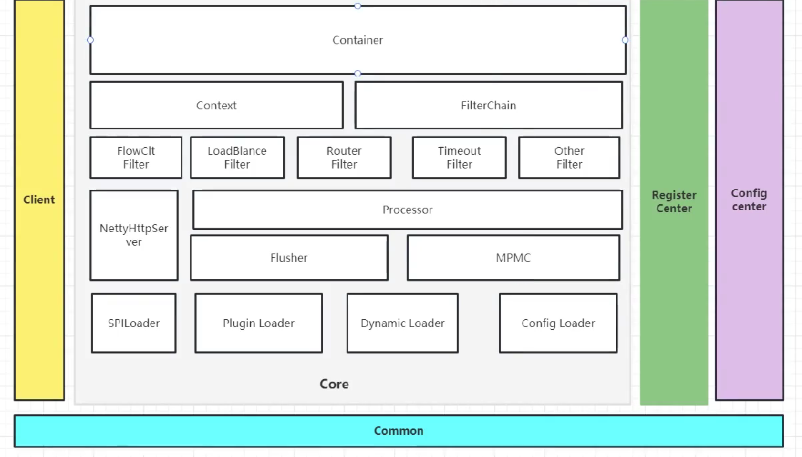

# 自研分布式Gateway中间件

>使用技术:  **JDK17、 Natty、 AsyncHttpClient、Nacos** \
>支持的网络协议：**HTTP、Dubbo**

### 架构图

### 网关性能
#### 异步化设计
> 请求可以使用单双异步模式，默认为单异步模式
- 单异步模式
- 双异步模式

#### 使用缓存(吞吐量为王)
**流量高峰使用本地缓存(Disruptor、MPMC)**

#### 设置合适的工作线程

- CPU密集型：CPU核心数 + 1

- IO密集型：CPU核心数 * 2

  
 